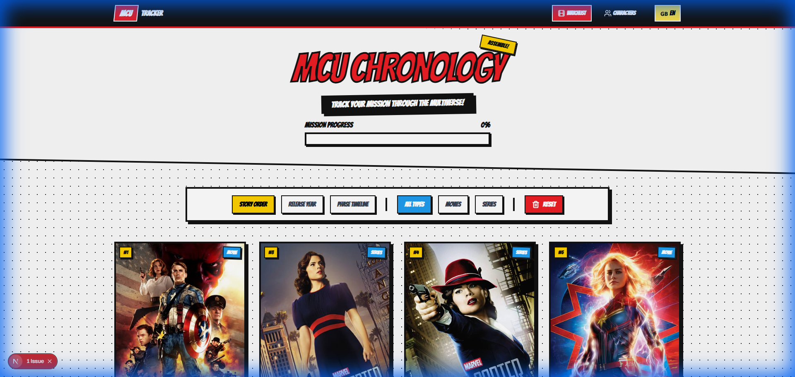
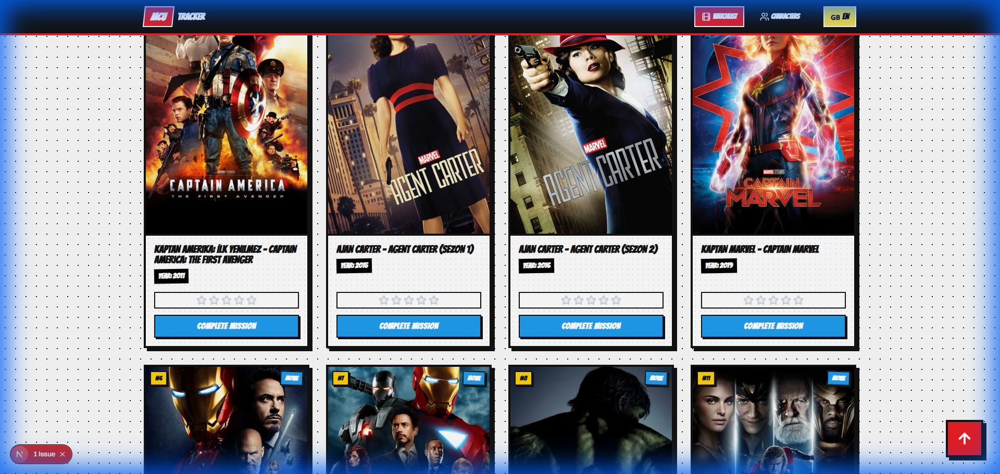
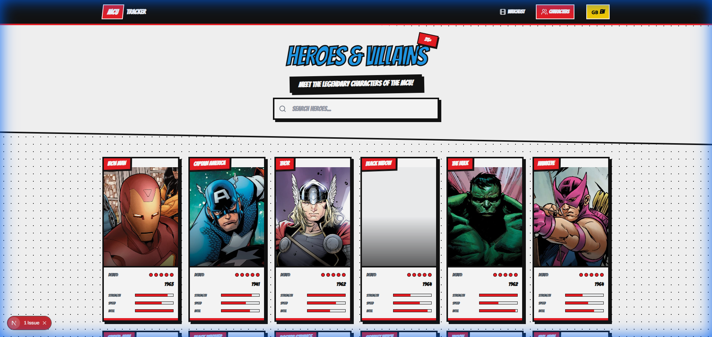
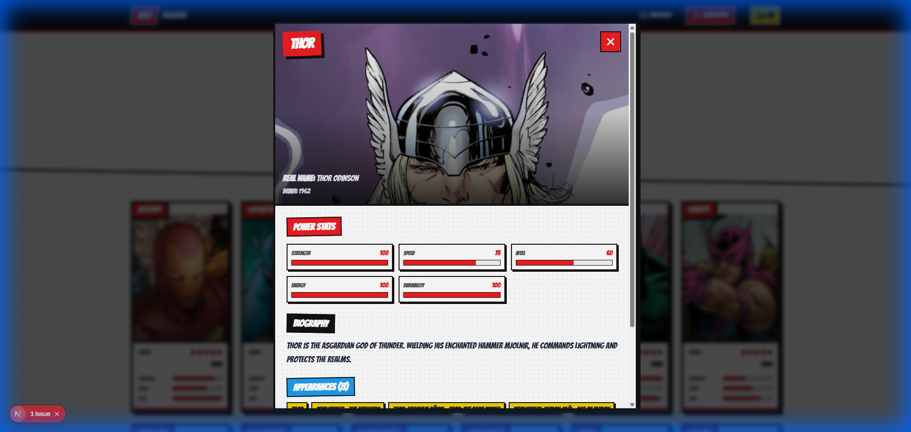
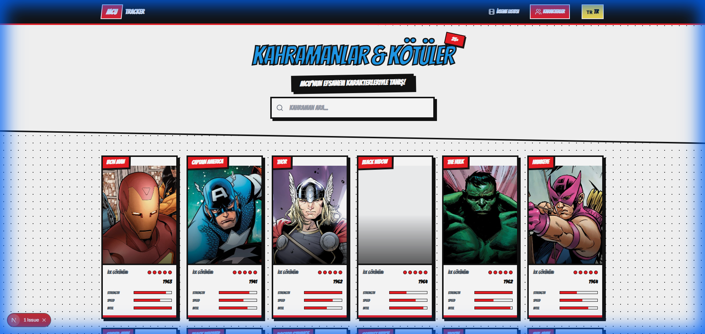

# 🦸 Marvel Watchlist - MCU Kronolojisi

<div align="center">



**MCU'nun tamamını kronolojik sırayla takip edin!**

[](https://nextjs.org/)
[](https://reactjs.org/)
[](https://tailwindcss.com/)

[🇬🇧 English](#english) | [🇹🇷 Türkçe](#türkçe)

</div>

---

## 🇹🇷 Türkçe

### ✨ Özellikler

- 📋 **Kronolojik İzleme Listesi** - 110+ MCU filmi ve dizisi hikaye sırasına göre
- 🎴 **Karakter Galerisi** - Çizgi roman tarzı trading card tasarımı
- 🌍 **Çift Dil Desteği** - Türkçe ve İngilizce
- ⭐ **Puan Sistemi** - Her yapıma 1-5 yıldız verin
- 📊 **İlerleme Takibi** - Tamamladığınız görevleri görün
- 🔍 **Filtreleme** - Hikaye sırası, çıkış yılı, faz veya tür bazında

### 📸 Ekran Görüntüleri

<details>
<summary><b>🎬 İzleme Listesi</b></summary>

Film ve dizi kartlarınızı izleyin, puanlayın ve takip edin:



</details>

<details>
<summary><b>🦸 Karakter Galerisi</b></summary>

Çizgi roman tarzı trading card tasarımıyla 25 MCU karakteri:



</details>

<details>
<summary><b>📊 Karakter Detayları</b></summary>

Her karakterin güç istatistikleri, biyografisi ve görünümleri:



</details>

<details>
<summary><b>🇹🇷 Türkçe Modu</b></summary>

Tüm uygulama Türkçe'ye çevrilebilir:



</details>

### 🚀 Kurulum

```bash
# Repo'yu klonlayın
git clone https://github.com/ulasdemir472/marvel-watchlist.git

# Klasöre gidin
cd marvel-watchlist

# Bağımlılıkları yükleyin
npm install

# Geliştirme sunucusunu başlatın
npm run dev
```

Tarayıcınızda [http://localhost:3000](http://localhost:3000) adresine gidin.

### 🛠️ Teknoloji Yığını

| Teknoloji | Kullanım |
|-----------|----------|
| **Next.js 16** | React framework |
| **React 19** | UI library |
| **Tailwind CSS** | Styling |
| **Lucide React** | İkonlar |
| **localStorage** | Veri saklama |

### 📁 Proje Yapısı

```
marvel-list/
├── src/
│   ├── app/
│   │   ├── page.js          # Ana sayfa
│   │   ├── characters/      # Karakter sayfası
│   │   └── layout.js        # Root layout
│   ├── components/
│   │   ├── Navbar.jsx       # Navigasyon
│   │   ├── CharacterCard.jsx
│   │   └── CharacterModal.jsx
│   ├── context/
│   │   └── LanguageContext.js
│   ├── data/
│   │   ├── index.js         # MCU verileri
│   │   └── characters.js    # Karakter verileri
│   └── locales/
│       └── index.js         # Çeviriler
└── screenshots/
```

---

## 🇬🇧 English

### ✨ Features

- 📋 **Chronological Watchlist** - 110+ MCU movies and series in story order
- 🎴 **Character Gallery** - Comic book style trading card design
- 🌍 **Bilingual Support** - Turkish and English
- ⭐ **Rating System** - Rate each entry from 1-5 stars
- 📊 **Progress Tracking** - See your completed missions
- 🔍 **Filtering** - By story order, release year, phase, or type

### 🚀 Installation

```bash
# Clone the repository
git clone https://github.com/ulasdemir472/marvel-watchlist.git

# Navigate to the directory
cd marvel-watchlist

# Install dependencies
npm install

# Start the development server
npm run dev
```

Open [http://localhost:3000](http://localhost:3000) in your browser.

### 🎯 Usage

1. **Track Progress**: Click "Complete Mission" on any movie/series to mark it as watched
2. **Rate Content**: Use the 5-star rating system on each card
3. **Filter View**: Use Story Order, Release Year, or Phase Timeline filters
4. **Switch Language**: Click the flag button in the navbar to toggle TR/EN
5. **Explore Characters**: Visit the Characters page to see hero trading cards

---

## 📝 License

This project is for educational purposes only. All Marvel characters and content are property of Marvel Studios / Disney.

## 👨‍💻 Author

**Ulas Demir**

- GitHub: [@ulasdemir472](https://github.com/ulasdemir472)

---

<div align="center">

**Made with ❤️ and lots of ☕**

*Excelsior!* 🦸‍♂️

</div>
